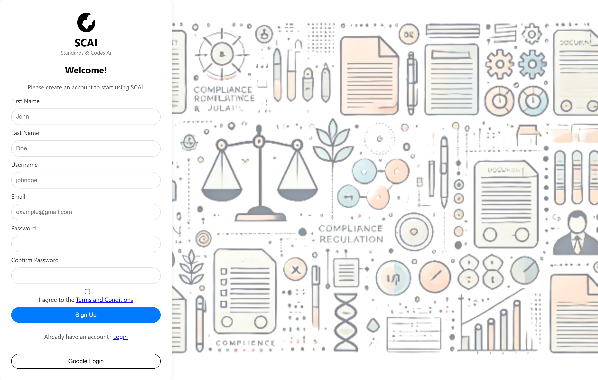
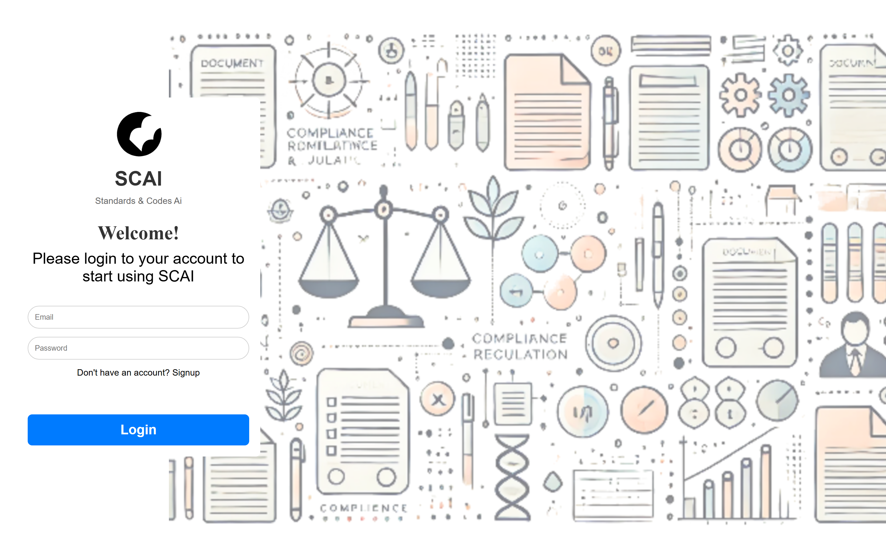
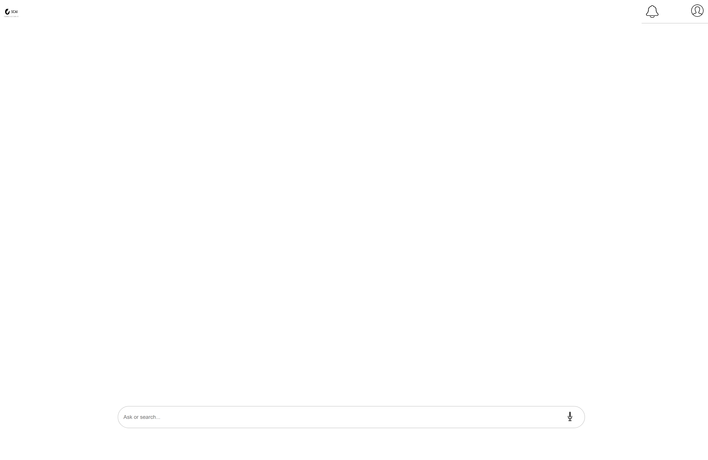
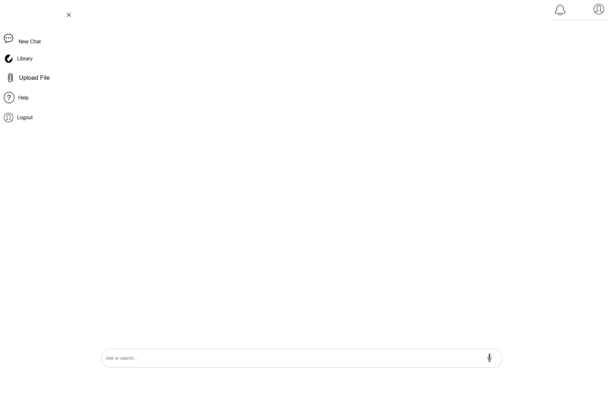
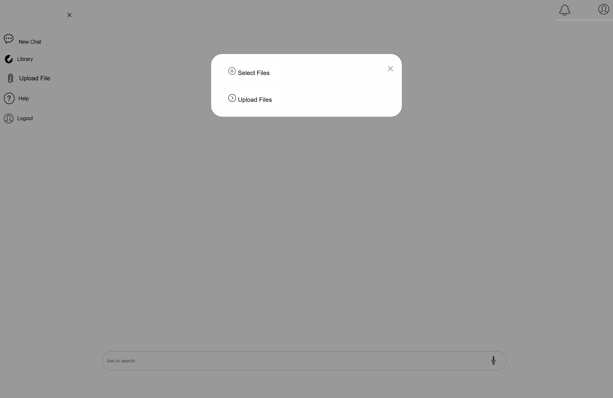
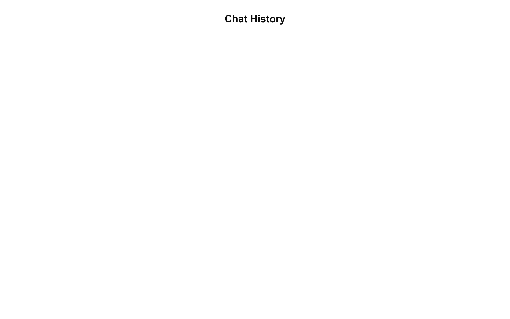
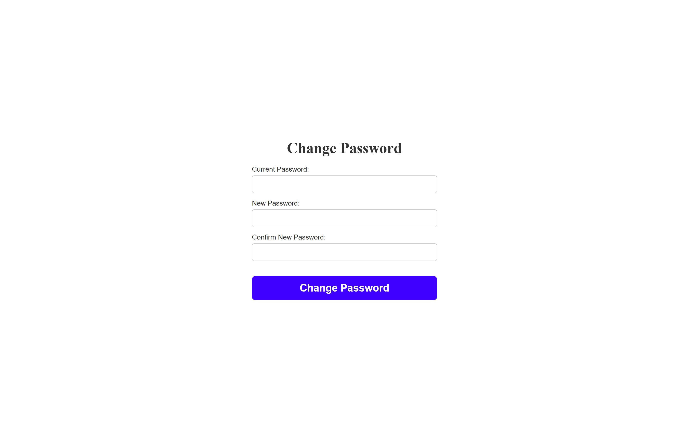
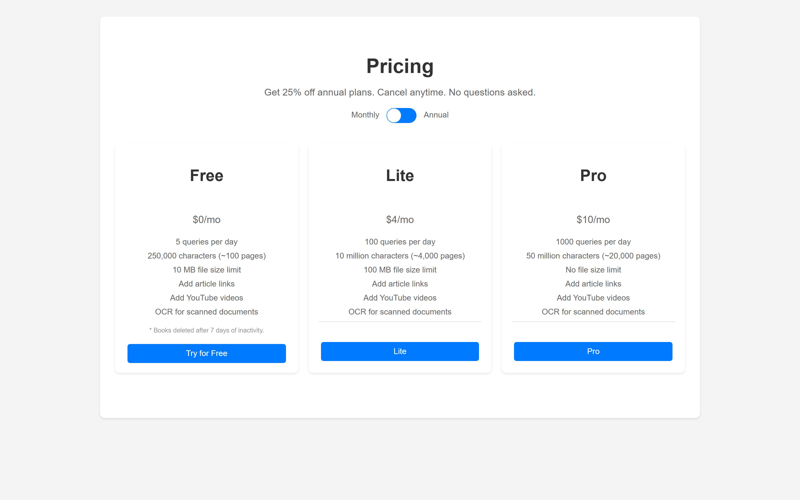
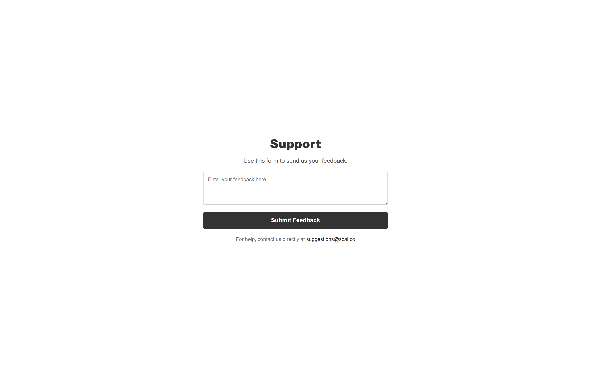
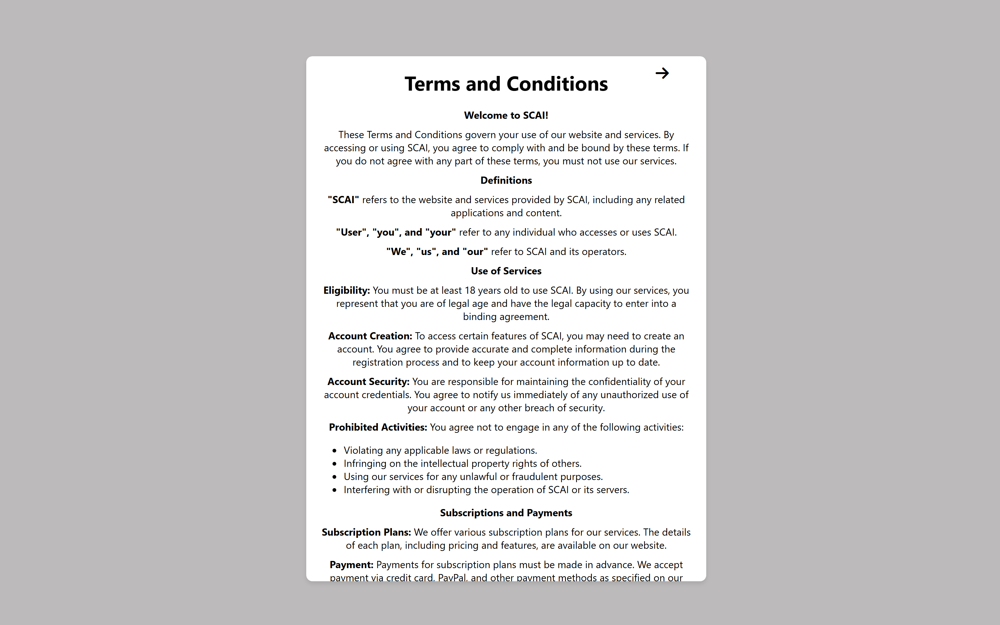

<div align="center">

# SCAI — Complete Design Walkthrough

**Every screen of the platform, captured start to end as full-page designer references.**

*All screenshots are true full-page captures (Playwright, 1600px viewport @2× retina) taken from the app running locally.*

</div>

---

## Design System at a Glance

| Element | Choice |
| :--- | :--- |
| Theme | Clean white, minimal — content-first |
| Accent | Bright blue (`#1a8cff` family) for CTAs and links |
| Typography | Rounded geometric sans (Poppins-style) for headings |
| Components | Pill buttons, card-based pricing, floating pill search bar |
| Iconography | Simple line icons (bell, user, mic, attach) |
| Layout | Centered hero → sectioned scroll (landing); sidebar + canvas (app) |

The design language follows the **modern AI-SaaS pattern**: a marketing landing page that sells the product, a friction-light auth flow, and a distraction-free ChatGPT-style workspace where the product itself lives.

---

## 1 · Landing Page — the front door

The complete marketing page in one scroll: hero with three-step value proposition (Upload → Search → Get answers), pricing tiers (Free / Lite / Pro), feature grid, FAQs, contact, and affiliate program.

<div align="center"></div>

**Design notes:** the hero uses a soft gray band to separate it from the white nav; a single blue CTA ("Launch SCAI") anchors the eye; social proof ("Join 50,000+ happy users") sits directly under the button.

---

## 2 · Registration — onboarding

<div align="center"></div>

**Design notes:** the full-bleed background image gives the auth pages personality while the form stays in a clean white card.

---

## 3 · Login

<div align="center"></div>

---

## 4 · Chat Workspace — the product

The heart of the platform: a distraction-free canvas with the SCAI brand top-left, notification and account icons top-right, and a floating pill input with voice-command mic at the bottom.

<div align="center"></div>

### 4b · Navigation sidebar (open)

New Chat · Library · Upload File · Help · Logout — a slide-in panel keeps navigation out of the way until needed.

<div align="center"></div>

### 5 · Document upload modal

Uploading PDFs into the RAG corpus happens in a rounded modal over a dimmed backdrop.

<div align="center"></div>

---

## 6 · Conversation History

Past sessions listed with human-readable timestamps ("2 hours ago"), replayable for audit and review.

<div align="center"></div>

---

## 7 · Account Settings

<div align="center"></div>

## 8 · Change Password

<div align="center"></div>

---

## 9 · Subscription — monetization

The upgrade page presenting the Professional tier (10 queries/day), wired to Stripe Checkout when billing is configured.

<div align="center"></div>

---

## 10 · Support & Feedback

<div align="center"></div>

## 11 · Terms & Conditions

<div align="center"></div>

## 12 · Privacy

<div align="center"></div>

---

## The User Journey, End to End

```
Landing (sell) → Register / Login (onboard) → Chat workspace (core product)
     │                                              │
     │                                   Upload PDFs → ask questions
     │                                   Voice output · follow-up suggestions
     │                                              │
     └── Pricing section ──────────► Subscribe (Stripe) → Pro tier
                                                    │
                              History · Account · Support · Legal
```

---

## How These Captures Were Made

Full-page captures were produced with Playwright against the locally running app (`SCAI-main/shots_public.py` and `SCAI-main/shots_app.py`) — viewport 1600px, `device_scale_factor=2`, `full_page=True`. Interaction states (open sidebar, upload modal) were captured by driving the real UI, the same way a designer documents component states.

<div align="center">

*Design documentation for [SCAI](README.md) · Muhammad Waqas*

</div>
