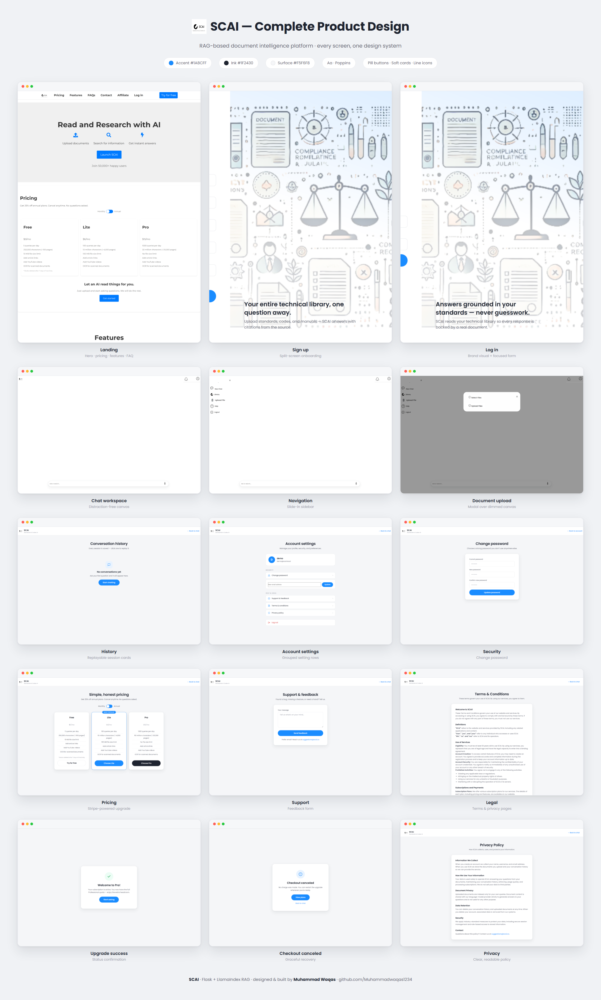
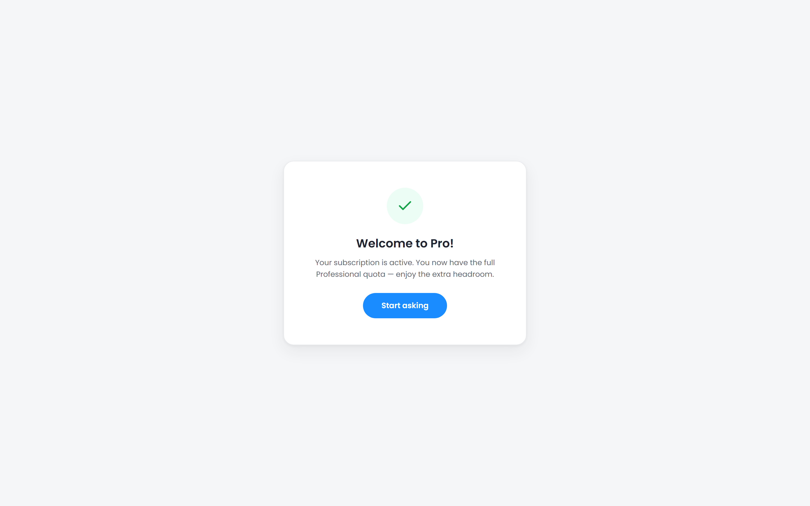
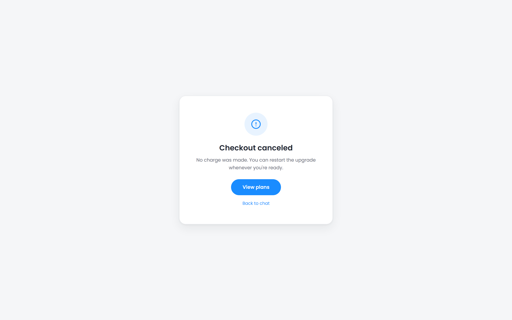

<div align="center">

# SCAI — Complete Design Walkthrough

**Every screen of the platform, captured start to end as full-page designer references.**

*All screenshots are true full-page captures (Playwright, 1600px viewport @2× retina) taken from the app running locally.*

<br>



*The one-image design sheet: all screens, one design system. ([full resolution](docs/design/design-sheet.png))*

</div>

---

## Design System

| Element | Choice |
| :--- | :--- |
| Theme | Clean white surfaces on soft gray (`#F5F6F8`) — content-first |
| Accent | Bright blue `#1A8CFF` for CTAs, links, and focus rings |
| Typography | **Poppins** across every page — headings 600, body 400 |
| Components | Pill buttons, soft-shadow cards, grouped setting rows, line icons |
| Auth pattern | Split-screen: focused form panel + brand visual with tagline |
| App pattern | Distraction-free canvas with slide-in sidebar and floating pill input |

The design language follows the **modern AI-SaaS pattern**: a marketing landing page that sells, a friction-light auth flow, a clean workspace where the product lives, and consistent utility pages that never break the visual system.

---

## 1 · Landing Page — the front door

The complete marketing page in one scroll: hero with three-step value proposition, pricing tiers, feature grid, FAQs, contact, and affiliate program.

<div align="center"></div>

---

## 2 · Registration — onboarding

Split-screen design: a focused form panel on the left, the brand illustration with a value-proposition tagline on the right. First/last name sit on one row to keep the form compact.

<div align="center"></div>

## 3 · Login

Same split-screen system — visual consistency between the two auth pages makes the flow feel like one product.

<div align="center"></div>

---

## 4 · Chat Workspace — the product

A distraction-free canvas: brand top-left, notifications and account top-right, floating pill input with voice-command mic at the bottom.

<div align="center"></div>

### 4b · Navigation sidebar

New Chat · Library · Upload File · Help · Logout — a slide-in panel keeps navigation out of the way until needed.

<div align="center"></div>

### 5 · Document upload modal

Adding PDFs to the RAG corpus happens in a rounded modal over a dimmed backdrop.

<div align="center"></div>

---

## 6 · Conversation History

Sessions as hoverable cards with time-since pills; expanded sessions replay as chat bubbles. A friendly empty state invites the first conversation.

<div align="center"></div>

---

## 7 · Account Settings

Profile card with avatar, then grouped rows — Security, Help & Legal — with inline SVG icons, an inline email-update form, and a clearly separated red logout action.

<div align="center"></div>

## 8 · Change Password

<div align="center"></div>

---

## 9 · Pricing & Subscription

Three plan cards with a highlighted "Most Popular" tier, monthly/annual toggle, and Stripe Checkout wiring.

<div align="center"></div>

### Upgrade outcome states

Success and cancellation each get a dedicated status card — no dead ends, always a next action.

<div align="center">


</div>

---

## 10 · Support & Feedback

<div align="center"></div>

## 11 · Terms & Conditions

<div align="center"></div>

## 12 · Privacy Policy

<div align="center"></div>

---

## The User Journey, End to End

```
Landing (sell) → Register / Login (onboard) → Chat workspace (core product)
     │                                              │
     │                                   Upload PDFs → ask questions
     │                                   Voice output · follow-up suggestions
     │                                              │
     └── Pricing section ──────────► Subscribe (Stripe) → success / cancel states
                                                    │
                              History · Account · Support · Legal
```

---

## How These Captures Were Made

Full-page captures were produced with Playwright against the locally running app (`SCAI-main/shots_public.py`, `shots_app.py`) — viewport 1600px, `device_scale_factor=2`, `full_page=True`. Interaction states (open sidebar, upload modal) were captured by driving the real UI. The one-image design sheet is composed in HTML (`docs/design/design-sheet.html`) and rendered with `shots_sheet.py`.

<div align="center">

*Design documentation for [SCAI](README.md) · Muhammad Waqas*

</div>
