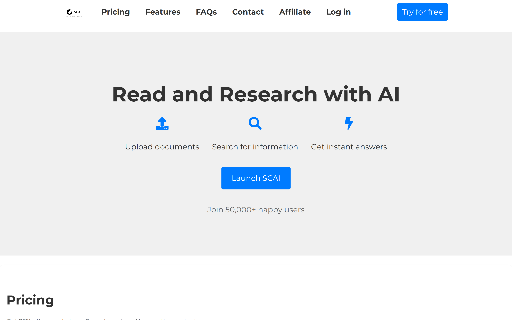
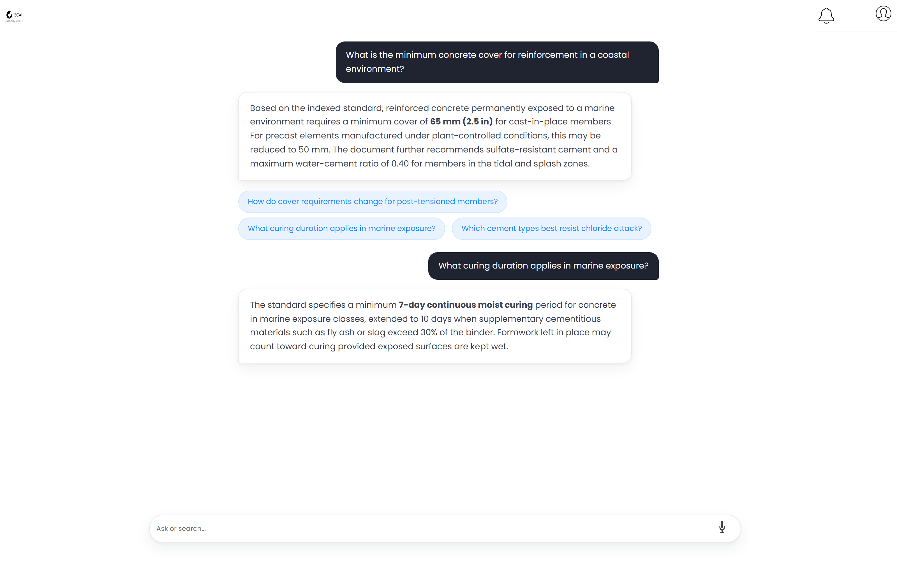

<div align="center">

# SCAI — RAG-Based AI Knowledge Platform

**A document intelligence SaaS for construction engineering — RAG-grounded answers from a private technical corpus, with users, quotas, history, voice output, and billing.**

<br>


-635BFF?style=flat-square&logo=stripe&logoColor=white)

<br>



</div>

---

## Overview

**SCAI (Standards & Codes AI)** answers construction engineering questions strictly from a private corpus of technical PDF documents using **Retrieval-Augmented Generation (RAG)**. Every response is grounded in the indexed source material — no hallucinated citations, auditable outputs.

The platform ships as a complete SaaS: registration and login, per-tier daily quotas, persistent conversation history, follow-up question generation, text-to-speech responses, and optional Stripe subscription billing.

> **Now fully local.** This project originally ran on **AWS DynamoDB**; it has been re-architected to run 100% locally with **SQLite** — zero cloud infrastructure, one command to start. The original cloud implementation is preserved in [`SCAI-main/app_aws_legacy.py`](SCAI-main/app_aws_legacy.py) for reference.

> 📐 **See the [complete design walkthrough](DESIGN.md)** — full-page captures of every screen, start to end.

<div align="center">

</div>

---

## Features

- **RAG engine** — PDFs are indexed with LlamaIndex (`VectorStoreIndex`); answers are generated by OpenAI models constrained to document content, with prompt-level hallucination control
- **Conversational workspace** — ChatGPT-style UI with query condensation, session memory, and automatic follow-up question suggestions
- **Document upload** — add PDFs from the UI; the vector index rebuilds automatically
- **Voice output** — every answer is synthesized to speech via gTTS and streamed to the client
- **User management** — registration, login, account settings, password/email change
- **Usage tiers** — Basic (5 queries/day) and Professional (10 queries/day), enforced per user
- **Conversation history** — complete sessions stored and replayable with human-readable timestamps
- **Billing (optional)** — Stripe Checkout subscriptions with webhook verification; the app runs fully without Stripe configured
- **Demo mode** — set `DEMO_MODE=1` to auto-login a demo account and explore instantly

---

## Architecture

```
Client UI (HTML/CSS/JS — landing, auth, chat workspace)
        │
Flask application layer (REST + sessions + quotas)
        │
RAG engine — LlamaIndex VectorStoreIndex over ./data PDFs
        │                       (index built once, cached in-process)
OpenAI LLM (constrained reasoning) + gTTS voice synthesis
        │
SQLite (users · chat history · feedback)     ← replaces AWS DynamoDB
        │
Stripe billing (optional)
```

| Layer | Technology |
| :--- | :--- |
| Application server | Python Flask |
| Language model | OpenAI (default `gpt-4o-mini`, configurable) |
| Retrieval engine | LlamaIndex `VectorStoreIndex` |
| Database | **SQLite** (single local file, auto-created) |
| Speech synthesis | Google Text-to-Speech (gTTS) |
| Payments | Stripe (optional) |
| Frontend | HTML, CSS, vanilla JavaScript |

---

## Getting Started

**Prerequisites:** Python 3.10+ and an OpenAI API key. That's it — no AWS account, no cloud setup.

```bash
git clone https://github.com/Muhammadwaqas1234/Retrieval-Augmented-Generation.git
cd Retrieval-Augmented-Generation/SCAI-main

python -m venv venv
venv\Scripts\activate            # Windows  (source venv/bin/activate on macOS/Linux)
pip install -r requirements.txt

copy .env.example .env           # then put your OPENAI_API_KEY in .env

flask --app app run              # → http://127.0.0.1:5000
```

Place your PDF corpus in `SCAI-main/data/` (a sample document is included), or upload PDFs from the UI once logged in.

**Quick exploration without registering:** add `DEMO_MODE=1` to `.env` and the app auto-logs you into a demo account.

---

## Configuration

| Variable | Required | Purpose |
| :--- | :--- | :--- |
| `OPENAI_API_KEY` | Yes | Powers embeddings and answer generation |
| `OPENAI_MODEL` | No | Model override (default `gpt-4o-mini`) |
| `SECRET_KEY` | No | Flask session secret (safe default for local runs) |
| `DEMO_MODE` | No | `1` auto-logins a demo account (local only) |
| `STRIPE_API_KEY` / `STRIPE_WEBHOOK_SECRET` / `STRIPE_PRICE_ID` | No | Enable subscription billing |

---

## Migration Notes (AWS → Local)

The re-architecture replaced every cloud dependency while keeping the UI and behavior identical:

- **DynamoDB → SQLite** — the three tables (Users, ChatHistory, Feedback) became a single-file SQLite database with the same schema semantics ([`database.py`](SCAI-main/database.py))
- **Index caching** — the vector index was previously rebuilt on every query; it is now built once per process and invalidated on document upload
- **Modern LlamaIndex** — migrated off the deprecated `ServiceContext` API to `Settings`
- **Stripe made optional** — billing routes return a clean "not configured" response instead of crashing without keys
- **Missing routes fixed** — `upload_file`, `change_email`, and `condition` endpoints referenced by the UI are now implemented

---

## License

© 2026 Muhammad Waqas. All rights reserved.

<div align="center">

<br>

*Built by [Muhammad Waqas](https://github.com/Muhammadwaqas1234) — AI Engineer · NLP & RAG Systems*

</div>
